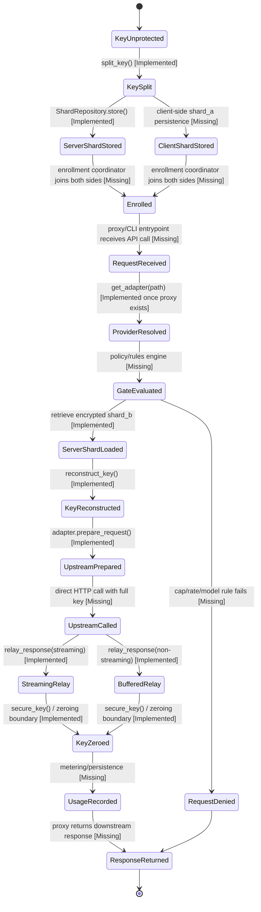

# State Machine

This state machine models the intended request lifecycle for `worthless/` and labels each state by current implementation status.

## State Notes

- `KeySplit`, `ServerShardStored`, `KeyReconstructed`, `UpstreamPrepared`, and the relay states are backed by code and tests today.
- `Enrolled`, `RequestReceived`, `GateEvaluated`, `UpstreamCalled`, `UsageRecorded`, and `ResponseReturned` are still roadmap states.
- `ProviderResolved` is logically implemented through `get_adapter()`, but only becomes a real runtime state once a proxy handler exists.

## Current Practical Reality

Today the repository supports only partial state-machine fragments:

1. crypto fragment
   `KeyUnprotected -> KeySplit -> KeyReconstructed -> KeyZeroed`

2. storage fragment
   `KeySplit -> ServerShardStored`

3. adapter fragment
   `RequestReceived -> ProviderResolved -> UpstreamPrepared -> relay_response`

The missing application layer is what turns those fragments into one coherent running system.
