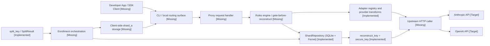
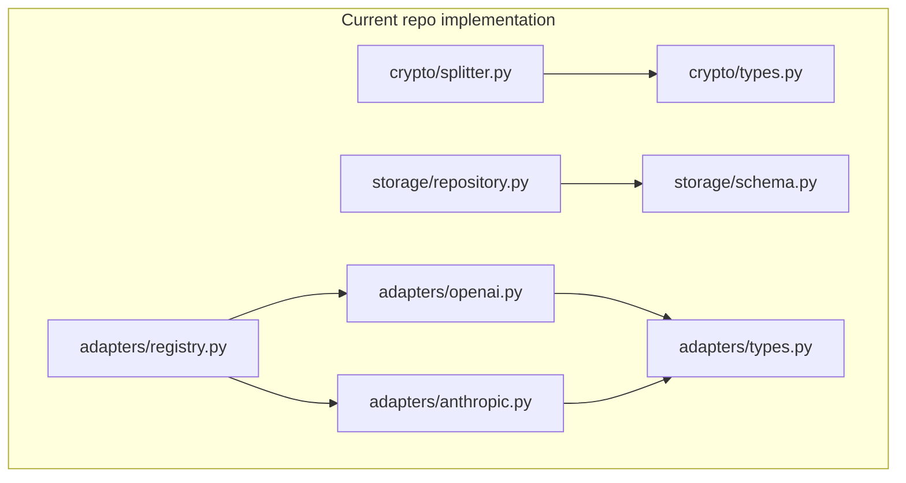

# System Diagram

This diagram shows the full intended `worthless/` system while distinguishing what exists in the repository from what is still planned.

Legend:
- `[Implemented]` present in `src/` or validated by tests
- `[Missing]` planned in `.planning/ROADMAP.md` but not yet implemented

## As-Built Component Map

## What Is Implemented

- split/reconstruct/zero lifecycle in `src/worthless/crypto/`
- encrypted `shard_b` persistence in `src/worthless/storage/`
- OpenAI and Anthropic request/response transforms in `src/worthless/adapters/`
- SSE passthrough behavior validated by `tests/test_streaming.py`

## What Is Missing

- a real request entry point
- enrollment flow joining crypto and storage
- client-side shard storage
- gate-before-reconstruct policy layer
- upstream call execution with reconstructed keys
- CLI UX
- security posture document
