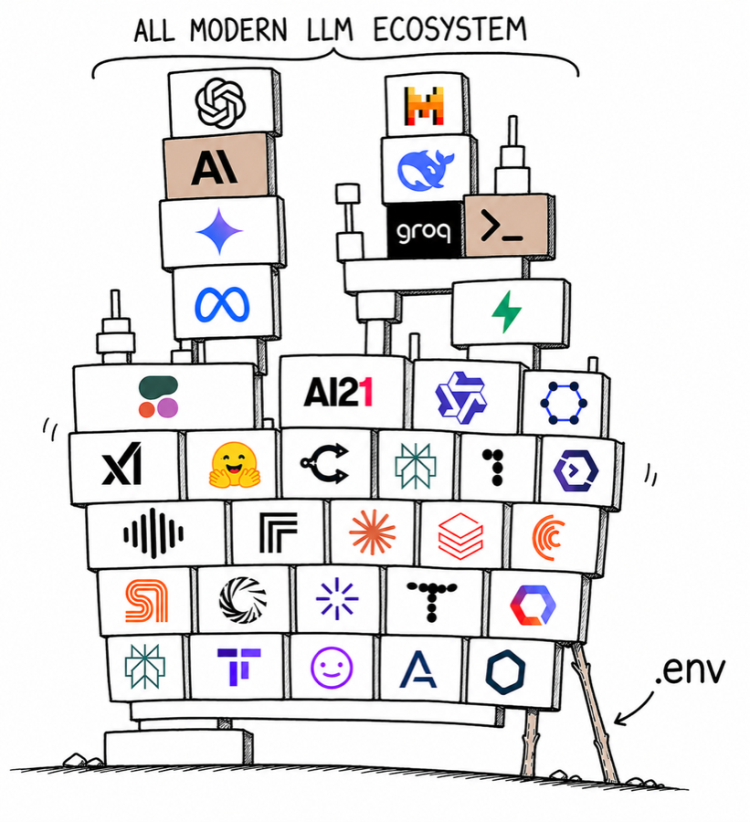

# Worthless

**Make leaked API keys worthless.**

<p align="center">
  
  <br>
  <sub style="color: #6c7e95;">Based on <a href="https://xkcd.com/2347/">XKCD #2347</a> by Randall Munroe (CC BY-NC 2.5)</sub>
</p>

[](https://www.python.org)
[](LICENSE)
[](https://github.com/shacharm2/worthless/actions/workflows/tests.yml)
[](https://securityscorecards.dev/projects/github.com/shacharm2/worthless)
[](https://snyk.io/test/github/shacharm2/worthless?targetFile=requirements.txt)
<!-- SonarCloud quality-gate badge, held until the existing issues are triaged. Re-enable when ready:
[](https://sonarcloud.io/summary/new_code?id=shacharm2_worthless)
-->

When your `.env` leaks, the keys inside are placeholders. The real key never sits in your repo, your shell history, or your laptop's memory.

## Quickstart

```bash
curl -sSL https://worthless.sh | sh        # fresh machine, no Python needed
# prefer to read it first?  curl -sSL 'https://worthless.sh?explain=1' | less
# or, if you already have Python 3.10+:
pipx install worthless
```

Then `cd` into your project and run `worthless`. It detects keys in your `.env`, splits them, starts a local proxy. No code changes.

The Worker emits an `X-Worthless-Script-Sha256` header so you can [verify the bytes you ran match the bytes the Worker advertised](https://docs.wless.io/install-security/) before piping into `sh`. The check catches transit/cache tampering, not origin compromise, cosign-signed release manifests for that are tracked in [WOR-303](https://linear.app/plumbusai/issue/WOR-303).

Full install options (Docker, MCP for Claude Code / Cursor / Windsurf, GitHub Actions, the verified-install flow, kill-switch runbook): **[docs.wless.io](https://docs.wless.io)**

## Scope

Worthless scans for **LLM provider API key prefixes only**, currently
`openai` (`sk-`, `sk-proj-`), `anthropic` (`sk-ant-`), `google`
(`AIza`), and `xai` (`xai-`). For general secret detection (cloud
tokens, GitHub PATs, AWS access keys, npm tokens, Cloudflare API
tokens, etc.), use
[gitleaks](https://github.com/gitleaks/gitleaks) or
[trufflehog](https://github.com/trufflesecurity/trufflehog) as a
companion tool, worthless will not flag those and is not trying to
replace them.

## How it works

1. `worthless lock` splits each API key into two shards
2. Shard A stays on your machine (encrypted). Shard B goes to the proxy database
3. Your `.env` is rewritten with shard A, format-preserving, but cryptographically useless alone
4. The proxy reconstructs the key only when the rules engine approves the request
5. Spend cap blown? The key never forms. The request never reaches the provider

## Platforms

| Platform | Status |
|---|---|
| macOS | Supported |
| Linux | Supported |
| Windows + WSL | Supported |
| Native Windows | Not supported, use WSL or Docker |

Native-Windows support is tracked in [WOR-237](https://linear.app/plumbusai/issue/WOR-237). See [docs.wless.io](https://docs.wless.io) for the full distro support matrix.

## Versioning

PyPI version, signed git tag (`vX.Y.Z`), and the `X-Worthless-Script-Tag` header on `worthless.sh` are kept aligned, CI fails fast if `pyproject.toml` and the tag disagree. By default `install.sh` installs a pinned `worthless==<version>`, the `WORTHLESS_VERSION_PIN` constant, hand-bumped per release like `UV_VERSION` and kept at the latest *published* release (a CI drift check fails if it falls behind), **not** PyPI `latest`, so a release compromised *after* yours cannot land on fresh installs. Override with `WORTHLESS_VERSION=x.y.z curl -sSL https://worthless.sh | sh`.

## Documentation

Everything lives at **[docs.wless.io](https://docs.wless.io)**, install guides, the security model, wire protocol, recovery runbook, the verified-install flow, and the agent skill file (Claude Code / Cursor / Windsurf).

## Development

```bash
git clone https://github.com/shacharm2/worthless && cd worthless
uv sync --extra dev --extra test
uv run pytest
```

Internal developer documentation lives in [`engineering/`](engineering/). Security invariants are in [`SECURITY.md`](SECURITY.md).

### Test Hardening & Repo Health

To maintain codebase health and prevent CI instability, the repository implements automated guards:
* **Thread Leak Detector**: Any unit test that leaks an active background thread will fail immediately. This prevents leaked threads from contaminating subsequent tests or causing runner crashes under `pytest-xdist`.
* **Flaky-Test Quarantine**: Flaky tests are detected at runtime and log high-visibility warnings to ensure root causes are investigated instead of swept under the rug. Quarantining a test requires a conscious human commit to `tests/quarantined_tests.txt`. Quarantined tests are excluded from the main blocking CI run and executed in a separate, non-blocking job.


## Contributing

Pull requests welcome. Before you start, read **[CONTRIBUTING.md](CONTRIBUTING.md)** and **[CONTRIBUTING-security.md](CONTRIBUTING-security.md)**.

All non-trivial contributions require a signed [Contributor License Agreement (CLA)](CLA.md). The CLA grants the project the right to relicense your contribution, including under commercial terms, so the open-source code can coexist with a future paid hosted service. See [CLA.md](CLA.md) for the full text.

## License

[AGPL-3.0](LICENSE)
