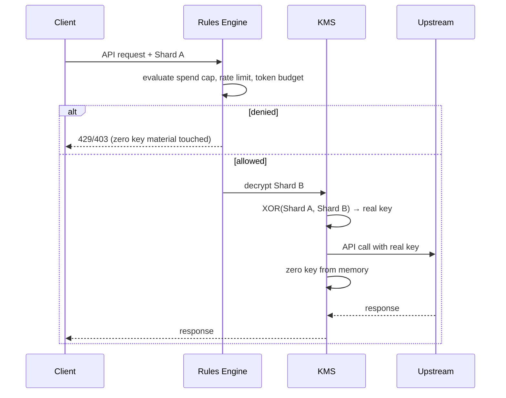

# Architecture

Technical deep dive into how Worthless works. For the quick version, see the [README](../README.md).

## Key splitting

Worthless uses XOR secret sharing to split an API key into two shards:

- **Shard A** — stays on your machine (never leaves)
- **Shard B** — encrypted with Fernet (AES-128-CBC + HMAC-SHA256), stored on the proxy

Neither shard reveals any information about the original key. This is information-theoretic security — not computational security. There is no key to brute-force because each shard is indistinguishable from random bytes without the other.

An HMAC-SHA256 commitment binds the two shards together, preventing tampering or substitution.

## Request lifecycle

### Gate before reconstruct

The rules engine evaluates every request **before** Shard B is decrypted. A denied request means:
- Zero KMS calls
- Zero decryption
- Zero key material in memory

This is the core security invariant. Budget exceeded = the key literally never exists.

### Server-side direct call

The reconstructed key never returns to the proxy service and never transits the network. The reconstruction service calls the upstream provider directly, then zeros the key.

## Cryptographic primitives

| Primitive | Purpose |
|-----------|---------|
| XOR secret sharing | Key splitting — each shard is uniformly random |
| HMAC-SHA256 | Commitment scheme — binds shards, prevents tampering |
| Fernet (AES-128-CBC + HMAC-SHA256) | Shard B encryption at rest |
| `bytearray` + explicit zeroing | Key material memory hygiene |
| `hmac.compare_digest` | Constant-time comparison (anti-timing-attack) |
| `os.urandom` (CSPRNG) | All random byte generation |

## Three invariants

Any change that violates these requires a full security review:

1. **Client-side splitting.** The split runs on the client only. The server never sees the full key or Shard A.
2. **Gate before reconstruct.** Rules evaluate before decryption. Denied = zero key material touched.
3. **Server-side direct call.** The reconstruction service calls the provider directly. The key never returns to the proxy.

## Services

| Service | Language | Responsibility |
|---------|----------|---------------|
| Proxy | Python / FastAPI | Rules engine, metering, audit logging |
| Reconstruction | Rust (planned) | KMS decrypt, XOR, upstream call, memory zeroing |
| CLI | Python | Enrollment, key splitting, wrap command |

## Wire protocol

See [PROTOCOL.md](PROTOCOL.md) for headers, endpoints, and error codes.

## Threat model

See [../docs/research/threat-model.md](research/threat-model.md) for the full threat model analysis.
