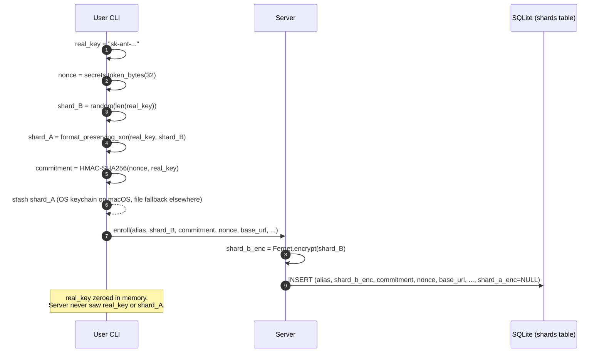
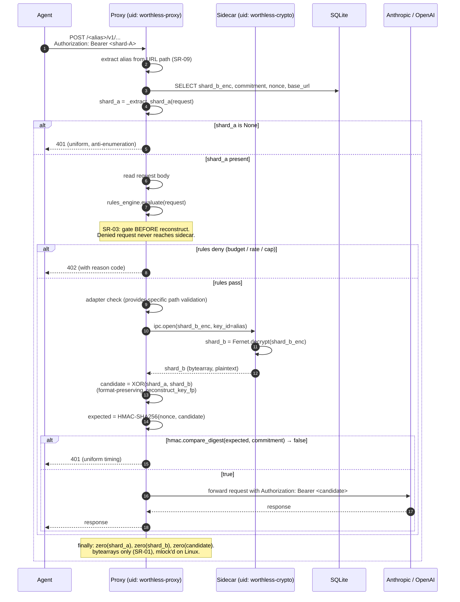

# Crypto Flows

Internal contributor reference. Source of truth for the cryptographic invariants enforced by the proxy auth path and the sidecar IPC stack. For the public-facing summary, see [`docs/security.md`](../docs/security.md). For the threat-model evidence rows, see [`engineering/sidecar-topology.md`](sidecar-topology.md) §4.

## Audience

Contributors touching `src/worthless/proxy/`, `src/worthless/crypto/`, or `src/worthless/storage/`. If you are adding a new IPC verb, a new auth path, or a new column on the `shards` table, read this first.

## Glossary

| Term | Definition | Code anchor |
|---|---|---|
| **Real key** | The original `sk-ant-...` / `sk-...` issued by the upstream provider. Reconstructed in-proxy on each request, byte-identical to enrollment. | — |
| **Shard-A** | Half-key delivered per-request in `Authorization: Bearer <shard-A>` (OpenAI shape) or `x-api-key: <shard-A>` (Anthropic shape). UTF-8 string at the network layer. | `_extract_shard_a` at `src/worthless/proxy/app.py:88-104` |
| **Shard-B** | The complementary half. Fernet-encrypted at rest in `shards.shard_b_enc`. Plaintext only inside the sidecar's address space. | `ShardRepository.store` / `fetch_encrypted` |
| **Fernet key** | The sidecar's symmetric key (AES-128-CBC + HMAC-SHA256, packaged). Never crosses the wall. Owned by uid `worthless-crypto`, mode `0400`. | sidecar process |
| **Nonce** | 32 bytes of CSPRNG randomness per row. Stored publicly in `shards.nonce`. Used as the HMAC key for the commitment. | `secrets.token_bytes(32)` at `src/worthless/crypto/splitter.py:89` |
| **Commitment** | `HMAC-SHA256(nonce, real_key)` — 32 bytes, stored in `shards.commitment`. The proxy re-derives this from any candidate reconstruction in-process; it does not need the Fernet key to verify. | `_make_commitment` at `src/worthless/crypto/splitter.py:83+`; `_verify_commitment` at `src/worthless/crypto/reconstruction.py:31-44` |
| **IPC `open()`** | The single IPC verb the proxy uses on shard-B: `await ipc.open(shard_b_enc, key_id=alias) -> bytearray`. | `src/worthless/proxy/ipc_supervisor.py` |
| **`shard_a_enc`** (legacy) | Column on the `shards` table. NULL on every modern enrolled row. Populated only on pre-Bearer-auth ("16x2") legacy rows that have not been re-locked. See [Legacy `shard_a_enc`](#legacy-shard_a_enc-column). | `src/worthless/storage/repository.py:227-233` |

## Architecture in one sentence

The proxy runs as two Unix users in the blessed deployment: `worthless-proxy` handles HTTP, `worthless-crypto` holds the Fernet key and runs reconstruction primitives. They speak one IPC verb — `ipc.open(ciphertext, key_id)` — over a local Unix-domain socket authenticated by `SO_PEERCRED`. Auth lives in the proxy. Cryptographic key material lives in the sidecar.

## Enrollment flow

One-time per alias, on the user's machine. The server never sees the real key or shard-A.

**Notes:**
- `shard_a_enc` is set to NULL on modern enrollments. The legacy 16x2-era code populated it; the current code never does.
- The commitment is a textbook keyed-hash commitment (HMAC-SHA256 with the public nonce as the key, real_key as the message). It is NOT a novel construction — its job is to bind a reconstruction to this specific row+alias and to be verifiable without holding the Fernet key.

## Request flow (modern path)

Every API call. The reconstructed key is forwarded upstream and zeroed immediately.

**Critical ordering:**
- **Shard-A extraction is PRE-gate.** The proxy needs to detect a missing Bearer to return 401 (not 402) and to short-circuit before reading the body. This does not violate the "gate before reconstruct" invariant — extracting shard-A is not reconstruction, just a header read.
- **Shard-B decryption and the XOR + commitment-verify are POST-gate.** No sidecar call occurs on a denied request.

## Defense layers — division of labor

The Fernet AEAD on `shard_b_enc` and the commitment HMAC are NOT redundant. They cover different layers.

| Layer | Defends against | Mechanism |
|---|---|---|
| **Fernet AEAD on `shard_b_enc`** | DB-at-rest tampering with shard-B ciphertext | Fernet's built-in MAC. Tampered ciphertext fails decryption inside the sidecar before XOR ever runs. |
| **Commitment HMAC** | **Cross-shard binding** — this row's shard-B + the right shard-A must reconstruct THIS alias's original key. Catches: row swap (wrong commitment/nonce paired), attacker-substituted shard-B (if attacker has the Fernet key), wrong-alias replay, post-rotation replay. | `HMAC-SHA256(nonce, reconstructed_key) == stored_commitment`, constant-time compare (SR-07). |
| **Rules gate (SR-03)** | Budget abuse, rate exhaustion, token-cap breach | Evaluated before any crypto runs. Denied request never touches the sidecar. |
| **Uniform 401 (anti-enumeration)** | Distinguishing valid-alias-wrong-key from invalid-alias from missing-Bearer | Same status code, same body, same timing. |

Honest framing: HMAC(nonce, key) with a public nonce is a textbook keyed-hash commitment. Its load-bearing property here is "verifiable without holding the Fernet key" — that's what lets the proxy verify a reconstruction without breaching the WOR-465 invariant. It is not a novel construction.

## Legacy `shard_a_enc` column

The `shards` table has a column `shard_a_enc` that is NULL on every modern enrollment. It exists for backwards compatibility with the 16x2 era (PR #198, commit `fe3f315`). In that era, BOTH shards were Fernet-encrypted at rest and the proxy decrypted them via sidecar — there was no Bearer header carrying shard-A.

The post-revert design moved shard-A to the Bearer header. `upsert_locked_shard` (`src/worthless/cli/commands/lock.py:406`) explicitly sets `shard_a_enc = NULL` on every re-lock, including the repository-layer assertion at `tests/test_relock_functional.py:498`.

### The structural invariant

The proxy auth code at `src/worthless/proxy/app.py:357` is explicit:

> *"This is the only auth path — the 16x2 stable-token path has been removed."*

No code path in the proxy uses `stored.shard_a` as a Bearer fallback. The repository-layer `decrypt_shard` branch at `repository.py:227-233` still decodes `shard_a_enc` when present (returning it on `StoredShard.shard_a`), but no caller in the proxy auth flow consumes that field. Other consumers (migration tooling, doctor, wrap) may; the proxy does not.

### Code-vs-test gap (WOR-615)

The invariant is structurally true but **not pinned by an adversarial regression test**. A future maintainer adding *"if Bearer is missing and `stored.shard_a` is not None, fall back to it for legacy rows"* would not be caught by CI.

[WOR-615](https://linear.app/plumbusai/issue/WOR-615) tracks:
1. An adversarial regression test that inserts a row with `shard_a_enc = Fernet.encrypt(<real shard-A>)` (bypassing `upsert_locked_shard`), sends a request without `Authorization: Bearer`, and asserts 401 + no upstream call + no reconstruction.
2. (Stretch) A startup assertion `SELECT COUNT(*) FROM shards WHERE shard_a_enc IS NOT NULL`. Non-zero → proxy refuses to start with a hint to run `worthless relock --all`.

## "16x2" — what the name means

`worthless-16x2` is the internal feature codename for the stable-auth-token-in-`openclaw.json` design shipped in PR #198 (commit `fe3f315`). In that design:
- OpenClaw (the AI-agent client) held an opaque stable token (`secrets.token_urlsafe(32)`) in `openclaw.json`.
- The proxy verified the token via `hmac.compare_digest` against a stored hash.
- The real shard-A was Fernet-encrypted in `shards.shard_a_enc` and decrypted by the sidecar at auth time.

The post-revert design (current code, baseline post-WOR-465 + post-WOR-549) moved shard-A directly into the Bearer header. `openclaw.json` now carries shard-A itself; no separate auth token is required.

The "16x2" name persists in:
- The test file `tests/test_proxy_auth_16x2.py` (preserved for git-blame continuity).
- The legacy `shard_a_enc` column (planned for removal in a future schema migration; see WOR-615 stretch).
- Inline comments referring to *"the 16x2 stable-token path has been removed"*.

No new code should use the term. The current architecture has no concept matching "16x2" beyond historical artifacts.

## Threat coverage matrix

What the design defends against, what falls, and what is explicitly out of scope.

| Attack | Outcome | Notes |
|---|---|---|
| Stolen DB only | **Defended** | Fernet protects `shard_b_enc`; commitment is one-way and leaks nothing about real_key. |
| Stolen DB + stolen Fernet key | **Falls partially** | Attacker decrypts shard_B values. Still needs shard_A (on client) to reconstruct. |
| Both shards stolen (DB + client keychain) | **Falls** | Both halves = key. Documented compromise scenario. |
| DB write attacker — swap `shard_b_enc` | **Defended (Fernet MAC)** | Fernet AEAD rejects tampered ciphertext inside sidecar. If attacker has Fernet key, commitment catches the swap because the resulting candidate won't HMAC to the stored commitment. |
| DB write attacker — swap `commitment` or `nonce` | **Defended** | Next legitimate request's reconstruction won't HMAC to the swapped commitment → 401. |
| Cross-alias replay (shard-A from alias X to alias Y) | **Defended** | Y's stored commitment/nonce pair won't match the X-vs-Y XOR result. |
| Old shard-A after key rotation | **Defended** | New shard_b + new commitment after relock → old shard-A reconstruction fails commitment. |
| Tampered legacy `shard_a_enc` injection | **Defended structurally; not test-pinned** | Proxy auth path doesn't consume `stored.shard_a`. WOR-615 will pin this. |
| Rules engine bug failing to deny | **Partial** | Commitment still catches tampered reconstruction. Does not catch a legitimate-key over-budget call — that's the rules gate's job. |
| Sidecar runtime compromise (read-memory or RCE on the crypto uid) | **Falls** | Attacker has the Fernet key in memory. Defense-in-depth via Rust + seccomp planned for v2.0. |
| TLS interception between sidecar and proxy | **Out of scope** | The IPC socket is local-only Unix-domain. Treated as inside the trust boundary. |
| Pre-enrollment MITM | **Falls** | The intercepting party stores their own commitment for their own shards. Mitigation: TLS pinning + out-of-band verification at enrollment. |
| Timing side-channel beyond HMAC compare | **Partial** | `hmac.compare_digest` is constant-time (SR-07). XOR loop and allocations are not. Documented in `docs/security.md` non-goals. |

## Sidecar IPC — assumed perms

The Unix-domain socket between the proxy and the sidecar is treated as inside the trust boundary. Assumptions:

| Property | Value | Where enforced |
|---|---|---|
| Path | `/run/worthless/sidecar.sock` (Docker) or per-install path | install scripts + sidecar startup |
| Perms | `0660` | sidecar `umask` + post-bind `chmod` |
| Owner | `worthless-crypto` | sidecar process effective uid |
| Group | `worthless-proxy` | sidecar groupadd at image build |
| Authentication | `SO_PEERCRED` — sidecar reads the connecting process's effective uid and rejects any uid other than the proxy's | sidecar accept loop |

If these perms drift (operator misconfiguration), any uid that is a member of `worthless-proxy`'s group could request decryption of arbitrary `shard_b_enc` blobs read from the DB. This is treated as a misconfiguration class, not a software vulnerability; install paths set perms correctly and operator audits should verify.

## References

### Code anchors
- `src/worthless/proxy/app.py:88-104` — `_extract_shard_a`
- `src/worthless/proxy/app.py:355-365` — SR-09 "only auth path" claim
- `src/worthless/crypto/splitter.py:83-96` — `_make_commitment`
- `src/worthless/crypto/reconstruction.py:31-44` — `_verify_commitment`
- `src/worthless/crypto/reconstruction.py:50-130` — `reconstruct_key_fp`
- `src/worthless/storage/repository.py:176-233` — `fetch_encrypted`, `decrypt_shard` (incl. legacy `shard_a_enc` branch)
- `src/worthless/cli/commands/lock.py:406` — `upsert_locked_shard` NULLs `shard_a_enc`

### Tests
- `tests/test_proxy_auth_16x2.py` — 19 proxy-auth tests pinning three sync guarantees + five SP-numbered hardening scenarios (WOR-549)
- `tests/test_relock_attacks.py` / `tests/test_relock_adversarial.py` — adversarial relock paths
- `tests/test_proxy_no_fernet_key_read.py` + `tests/ipc/test_proxy_client_unit.py` — WOR-465 guardrail (20 tests, "proxy never holds Fernet key bytes")
- `tests/cli/test_doctor_purge.py` — 6 doctor recovery flows

### SR rules
- **SR-01** key material in `bytearray`, never `bytes`
- **SR-02** explicit zeroing on every exit path
- **SR-03** gate before reconstruct
- **SR-04 / SR-05** no secrets in logs, `repr`, or tracebacks
- **SR-07** constant-time compare (`hmac.compare_digest`)
- **SR-08** CSPRNG only (`secrets`, never `random`)
- **SR-09** alias from URL path, never disk scan; Bearer is the only auth path

### Linear tickets
- [WOR-306](https://linear.app/plumbusai/issue/WOR-306) — sidecar isolation epic
- [WOR-465](https://linear.app/plumbusai/issue/WOR-465) — proxy uid never holds Fernet key bytes (load-bearing invariant)
- [WOR-549](https://linear.app/plumbusai/issue/WOR-549) — 40 proxy-auth tests un-skipped through sidecar IPC; this doc's predecessor
- [WOR-609](https://linear.app/plumbusai/issue/WOR-609) — tighten WOR-465 guardrail to env-inheritance paths
- [WOR-610](https://linear.app/plumbusai/issue/WOR-610) — triage sibling relock files still skipped
- [WOR-614](https://linear.app/plumbusai/issue/WOR-614) — required-CI live-e2e check for risky paths
- [WOR-615](https://linear.app/plumbusai/issue/WOR-615) — pin SR-09 "only auth path" with adversarial test + startup assertion

### Related docs
- [`docs/security.md`](../docs/security.md) — public-facing threat model and invariants
- [`engineering/sidecar-topology.md`](sidecar-topology.md) — §4 9-row red-team table → test mapping; §11 why the sidecar does not use the OS keyring
- [`CONTRIBUTING-security.md`](../CONTRIBUTING-security.md) — full SR-* rule definitions
