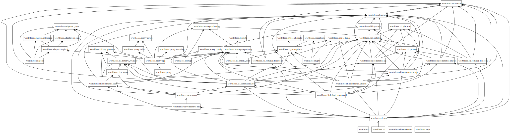
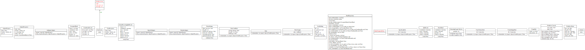

# Pyreverse Output

This directory contains deterministic structure artifacts produced from the current Python package layout via `pyreverse`.

The rendered artifacts are checked into the repo. Regeneration is a maintainer task and currently requires a local `pyreverse` installation outside the committed project dependency set.

Current outputs:

- `packages_worthless.dot`: package dependency and containment view
- `classes_worthless.dot`: class relationship view
- `packages_worthless.svg`: rendered package dependency and containment diagram
- `classes_worthless.svg`: rendered class relationship diagram

Use these artifacts to:

- verify package/class structure claims in generated docs
- detect drift between code layout and engineering documentation
- ground future AI-generated updates in real structure

## Rendered diagrams

### Package view

### Class view

