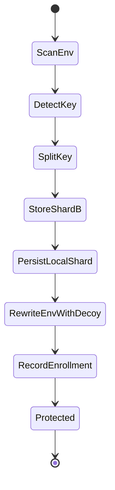
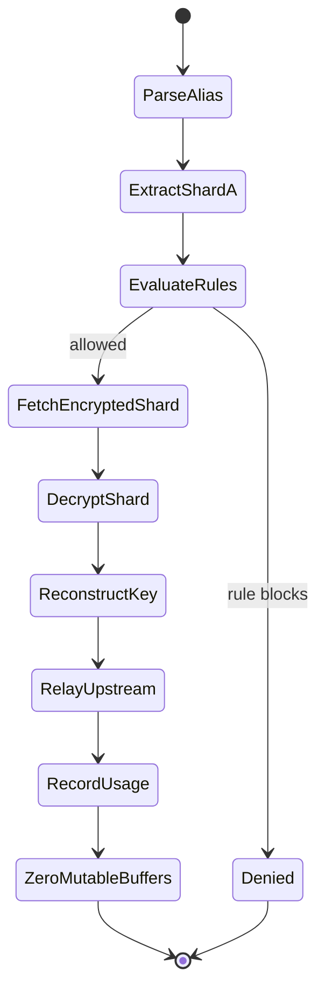
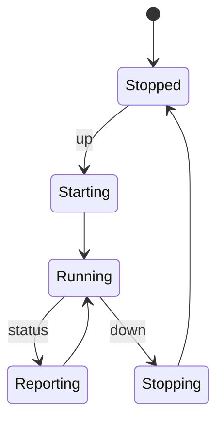
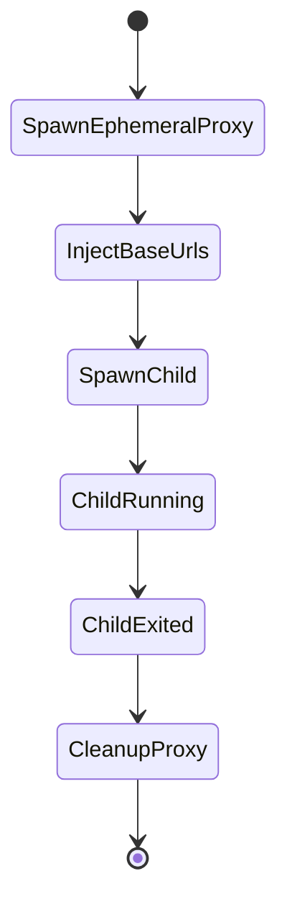
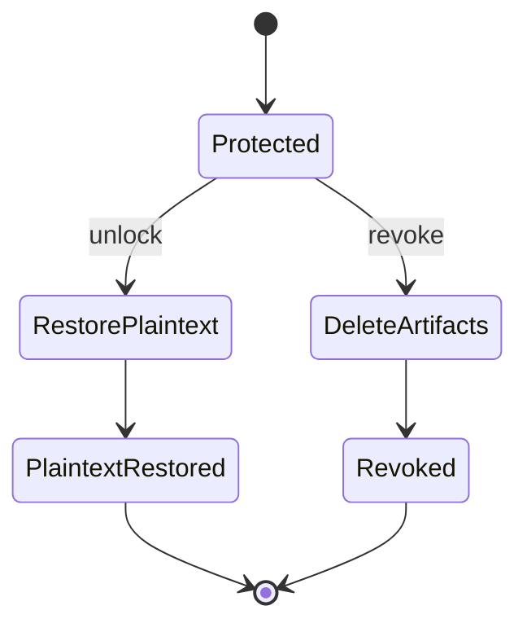

# State Machines

## Enrollment / lock flow

Important note:

- the current implementation is multi-step and has intermediate states; storage and rewrite operations do not happen as one atomic black box

## Request handling flow

Important note:

- the key security invariant is gate-before-reconstruct

## Daemon lifecycle

## Wrap lifecycle

## Recovery and deletion

Important note:

- `unlock` intentionally reintroduces plaintext
- `revoke` is a deletion-oriented path with best-effort local wipe semantics
